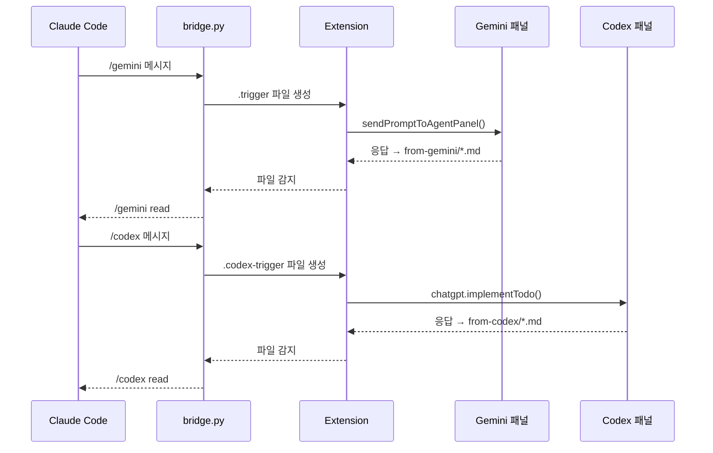

# Agent Bridge

Claude Code와 Antigravity IDE(Gemini + Codex)를 연결하는 브릿지입니다. 파일 기반 트리거로 Claude에서 Gemini/Codex에게 메시지를 보내고, 응답을 자동으로 수집합니다.

## 왜 만들었나

AI 코딩 에이전트 하나로는 부족할 때가 있습니다. Claude는 코드 작성과 리팩토링에 강하고, Gemini는 웹 검색과 디자인 리뷰에, Codex는 코드 리팩토링과 버그 수정에 강합니다. 이 브릿지를 통해 여러 AI가 하나의 프로젝트에서 협업할 수 있습니다.

- Claude가 코드를 작성하다가 디자인 피드백이 필요하면 Gemini에게 요청합니다
- Gemini의 웹 검색 결과를 Claude가 받아서 코드에 반영합니다
- 코드 리팩토링이나 테스트 작성은 Codex에게 맡길 수 있습니다
- 이미지 생성, UI 목업 등 Gemini의 강점을 Claude 워크플로우 안에서 활용합니다

## 협업 팁

### 코드 작업은 Claude, 검토와 조사는 Gemini

기본적으로 코드 작성, 수정, 리팩토링은 Claude에게 맡기고, Gemini에게는 디자인 리뷰, 웹 리서치, 이미지 생성 등을 맡기는 것이 효과적입니다.

### 점수 기반 합의

설계 방향이나 기술 선택에서 의견이 갈릴 때, Claude에게 이렇게 지시하면 좋습니다:

> "Gemini에게 이 설계안을 보내고, 각 항목별로 1~10점을 매겨달라고 해.
> Gemini 응답이 오면 네 점수와 비교해서 합의된 방향으로 진행해."

두 AI의 관점을 합쳐서 더 균형 잡힌 결정을 내릴 수 있습니다.

### Gemini에게 맡기면 좋은 작업

| 작업 | 예시 |
|------|------|
| 디자인 리뷰 | "이 페이지 UI 개선점 알려줘" |
| 웹 리서치 | "2026년 React 상태관리 라이브러리 비교해줘" |
| 이미지 생성 | "이 앱의 OG 이미지 만들어줘" |
| 크로스체크 | "이 API 설계가 RESTful 원칙에 맞는지 확인해줘" |

### Codex에게 맡기면 좋은 작업

| 작업 | 예시 |
|------|------|
| 코드 리팩토링 | "이 함수를 더 효율적으로 리팩토링해줘" |
| 코드 리뷰 | "이 PR 코드 리뷰해줘" |
| 버그 수정 | "이 에러 원인 찾아서 수정해줘" |
| 테스트 작성 | "이 모듈의 유닛 테스트 작성해줘" |
| 문서화 | "이 API의 JSDoc 작성해줘" |

### 실전 워크플로우 예시

```
1. Claude에게 기능 구현 요청
2. /gemini 이 코드의 UI 디자인 리뷰해줘 (스크린샷 첨부)
3. /gemini read 로 Gemini 피드백 확인
4. Claude에게 피드백 반영 지시
```

## 실제 사용 예시

투두 앱을 만들면서 Claude, Gemini, Codex 세 AI가 협업하는 과정입니다.

### 1. Claude에게 자연어로 지시

한 문장으로 Gemini와 Codex에게 동시에 작업을 맡깁니다.


### 2. Gemini가 디자인 작업 수행

Gemini가 트리거를 받아 아이콘 생성 작업을 시작합니다.


### 3. Codex가 코드 리뷰 + 결과 확인

Codex가 코드 리뷰를 완료하고, Gemini의 응답도 함께 확인합니다.


### 4. 세 AI가 함께 토의

개선 아이디어를 Gemini와 Codex에게 동시에 요청합니다.


### 5. 토의 결과 — 투표로 결정

세 AI의 제안을 표로 정리하고, 투표로 최종 결정합니다.


## 동작 원리



## 설치

### 1. 클론합니다

```bash
git clone https://github.com/YTH-Public/agent-bridge.git
cd agent-bridge
```

### 2. 배포합니다

```bash
bash deploy.sh
```

Windows(Git Bash)에서 실행하면 WSL + Windows 양쪽에 자동으로 배포됩니다.

### 3. Antigravity 설정

Extension이 로드되려면 최초 1회 재시작이 필요합니다.

> **중요: 패널을 반드시 열어야 합니다**
>
> 브릿지가 동작하려면 Antigravity에서 아래 패널이 **열려 있어야** 합니다:
> - **Gemini 사용 시**: Agent 패널 (우측 사이드바)
> - **Codex 사용 시**: Codex 패널 (좌측 사이드바) — [Codex 익스텐션](https://marketplace.visualstudio.com/items?itemName=OpenAI.chatgpt-codex) 설치 필요
>
> 패널이 닫혀 있으면 트리거가 전달되지 않습니다.

### 배포 대상

| 소스 | WSL | Windows |
|------|-----|---------|
| `src/bridge.py` | `~/.claude/skills/agent-bridge/bridge.py` | — |
| `src/SKILL-wsl.md` | `~/.claude/skills/agent-bridge/SKILL.md` | — |
| `src/SKILL-windows.md` | — | `~/.claude/skills/agent-bridge/SKILL.md` |
| `src/SKILL-codex-wsl.md` | `~/.claude/skills/agent-bridge/SKILL-codex.md` | — |
| `src/SKILL-codex-windows.md` | — | `~/.claude/skills/agent-bridge/SKILL-codex.md` |
| `src/GEMINI.md` | `~/.gemini/GEMINI.md` | `~/.gemini/GEMINI.md` |
| `extension/*` | `~/.antigravity-server/extensions/...` | `~/.antigravity/extensions/...` |

## 사용법

Claude Code에서 아래 명령어를 사용합니다:

### Gemini

```
/gemini init                    # 프로젝트에 bridge 구조를 초기화합니다
/gemini <메시지>                # Gemini에게 메시지를 전송합니다
/gemini ask <메시지>            # 전송 후 응답을 기다립니다 (자동 재시도 포함)
/gemini read                    # 최신 Gemini 응답을 읽습니다
/gemini list                    # 응답 목록을 확인합니다
/gemini search <키워드>         # 키워드로 검색합니다
```

### Codex

```
/codex init                     # 프로젝트에 bridge 구조를 초기화합니다
/codex <메시지>                 # Codex에게 메시지를 전송합니다
/codex ask <메시지>             # 전송 후 응답을 기다립니다
/codex read                     # 최신 Codex 응답을 읽습니다
/codex list                     # 응답 목록을 확인합니다
/codex search <키워드>          # 키워드로 검색합니다
```

## 주요 기능

### 병렬 전송 (Gemini + Codex 동시)

Gemini와 Codex에게 동시에 메시지를 보낼 수 있습니다. "제미나이와 코덱스 둘 다 보내줘"라고 하면 Claude가 자동으로 병렬 전송합니다.

```
/gemini 이 UI 디자인 리뷰해줘     # 즉시 전송 (논블로킹)
/codex 이 코드 리팩토링해줘        # 즉시 전송 (논블로킹)
```

`status` 커맨드로 양쪽 응답 상태를 한눈에 확인합니다:
```
Gemini: ✅ from-gemini/2026-03-14_01-30_ui-review.md (2분 전)
Codex:  ⏳ 응답 대기 중
```

### WSL Remote 지원

Antigravity를 WSL Remote로 연결해도 브릿지가 동작합니다. 익스텐션이 `extensionKind: ["workspace"]`로 설정되어 WSL 쪽에서 직접 실행됩니다.

### 한글 별칭

"제미나이", "코덱스", "챗지피티" 등 한글로 부를 수도 있습니다.

### 자동 재시도 (Auto-Continue)

Gemini가 에러로 멈추면 자동으로 "continue"를 보내 복구합니다.

- **Extension**: `from-gemini/`에 10분간 새 파일이 없으면 자동 재전송합니다 (최대 3회)
- **bridge.py `ask` 모드**: 동일한 로직을 CLI에서 수행합니다 (`--timeout 600 --retries 3`)

### 자동 디렉토리 감지

`/gemini init` 후 Antigravity를 재시작하지 않아도 `bridge/from-claude/` 생성을 자동으로 감지하여 트리거 감시를 시작합니다.

### 자동 권한 승인

트리거 전송 후 Gemini의 파일 접근 권한 요청을 자동으로 승인합니다 (최대 35분).

### 태스크 카테고리 자동 라우팅

Claude가 메시지 내용을 분석하여 적절한 `[TASK: <category>]` 헤더를 자동으로 부여합니다:

| 카테고리 | 용도 |
|---------|------|
| `design-review` | UI/UX 피드백 |
| `design-create` | 목업, 스타일링 |
| `web-research` | 웹 조사 |
| `image-generate` | 이미지 생성 |
| `verify-check` | 접근성, SEO 체크 |
| `general` | 일반 요청 |

## 레포 구조

```
agent-bridge/
├── deploy.sh                  # WSL + Windows 양쪽 배포 (환경 자동 감지)
├── src/
│   ├── bridge.py              # CLI 스크립트 (순수 Python3 stdlib)
│   ├── SKILL-wsl.md           # WSL Claude Code용 Gemini 스킬
│   ├── SKILL-windows.md       # Windows Claude Code용 Gemini 스킬
│   ├── SKILL-codex-wsl.md     # WSL Claude Code용 Codex 스킬
│   ├── SKILL-codex-windows.md # Windows Claude Code용 Codex 스킬
│   ├── GEMINI.md              # Gemini 글로벌 규칙
│   └── IMPROVEMENTS.md        # 개선 이력
└── extension/
    ├── extension.js           # Antigravity 익스텐션 (Gemini + Codex)
    ├── package.json
    └── .vsixmanifest
```

## 업그레이드

```bash
cd agent-bridge
git pull
bash deploy.sh
```

## 요구사항

- Claude Code (WSL 또는 Windows)
- Antigravity IDE (Gemini 에이전트 활성, Codex 사용 시 Codex 익스텐션 설치)
- Python 3 (WSL)
- Git Bash (Windows)

## 설정 커스터마이즈

`deploy.sh` 상단의 변수를 환경에 맞게 수정합니다:

```bash
EXT_PUBLISHER="yth1133"    # Antigravity 퍼블리셔명 (본인 것으로 변경)
EXT_NAME="claude-bridge"   # 익스텐션 이름
EXT_VERSION="0.2.0"        # 익스텐션 버전
```

publisher를 변경할 경우 아래 파일들도 함께 수정해야 합니다:
- `extension/package.json` → `"publisher"` 필드
- `extension/.vsixmanifest` → `<Identity ... Publisher="..." />`
